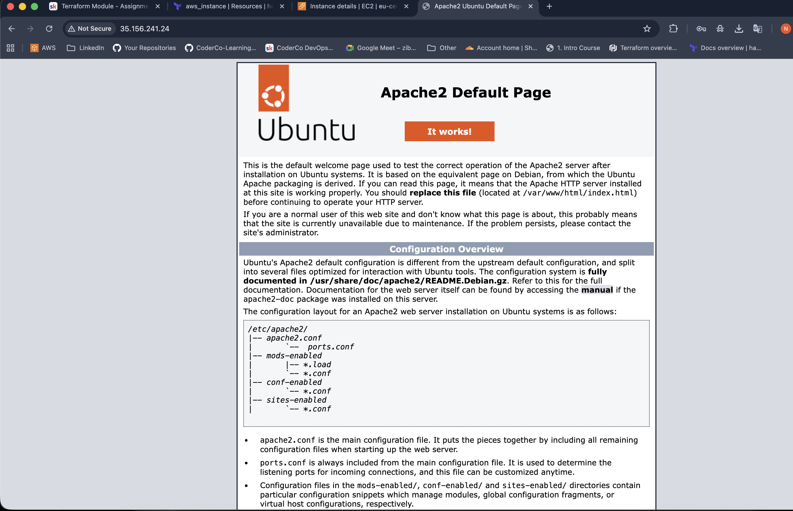

# EC2 Deployment with Cloud-Init

In this project, I used Terraform to deploy an EC2 instance on AWS using cloud-init. Unlike the first assignment, where I installed WordPress with a Bash script in user_data, here I explored the more standardized approach of cloud-init, which is widely used for bootstrapping servers.

## Architecture

- EC2 Instance: A t3.micro instance running Ubuntu, fully configured using cloud-init.
- Security Group: Allows HTTP (80), HTTPS (443), and SSH (22) from any IP.
- Cloud-init: Automates installation and setup of Apache, PHP, and WordPress.
- Modules: The EC2 instance and security group are managed through a Terraform module (modules/) to keep the configuration clean and reusable.

## main.tf

Calls the module ec2 module, which creates the EC2 instance and its security group:

```hcl
module "cloud_init_ec2" {
  source = "./modules"
}
```

## cloud-init.yaml
cloud-init.yaml

A YAML file executed on instance boot that:
- Installs Apache, PHP, and WordPress dependencies.
- Downloads and extracts WordPress into /var/www/html.
- Sets correct ownership for the web server.
- Starts and enables Apache.

```yaml
#cloud-config

packages:
  - apache2
  - php
  - php-mysql
  - wget
  - tar
  - unzip

runcmd:
  - systemctl enable apache2
  - systemctl start apache2
  - cd /var/www/html
  - wget https://wordpress.org/latest.tar.gz
  - tar -xzf latest.tar.gz
  - mv wordpress/* .
  - rm -rf wordpress latest.tar.gz
  - chown -R www-data:www-data /var/www/html
```

## variables.tf

Contains:
- ami_id – Ubuntu AMI
- instance_type – t3.micro
- aws_region – eu-central-1

## outputs.tf

Provides:
- ec2_public_ip
- ec2_public_dns

## Steps Taken

1. Initialized Terraform and configured AWS provider.
2.	Created a module to encapsulate the EC2 instance and its security group.
3.	Wrote a cloud-init script (cloud-init.yaml) to automate software installation.
4.	Ran terraform apply to deploy the instance.
5.	Verified that Apache and WordPress were running immediately after boot.

## Result
- A working EC2 instance accessible via public IP/DNS.
- Apache, PHP, and WordPress installed automatically at boot.
- Clean separation of code using modules 

