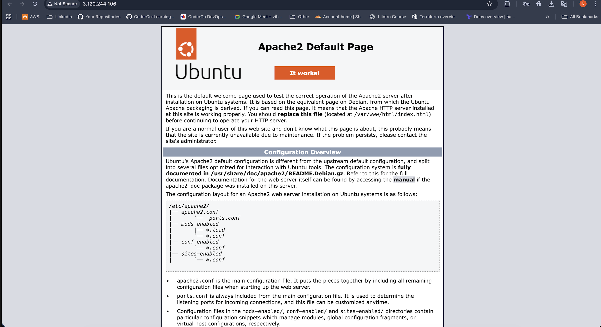

# Deploy Wordpress Using Terraform

## Overview 

In this project, I deployed a full WordPress stack on AWS using Terraform.

The goal was to understand how Terraform manages real infrastructure end-to-end, including EC2 instances, security groups, and automated instance setup with a user data script.

The deployment includes:
- An EC2 instance running WordPress
- Security groups allowing HTTP, HTTPS, and SSH access
- User data script to install Apache, PHP, and WordPress
- A publicly accessible WordPress site

## Steps

### 1. Set up Terraform

I created the Terraform configuration files:
- provider.tf: Defines the AWS provider
- main.tf: defines the EC2 instance and and security groups
- variables.tf: Stores input variables like AMI ID, instance type, and region
- outputs.tf: Exposes the instance’s public IP and DNS

### 2. Configure Security Groups

To control access, I created a security group with these rules:
- HTTP (port 80) → open to the world
- HTTPS (port 443) → open to the world
- SSH (port 22) → open to the world (for testing)
- All outbound traffic allowed

### 3. Create EC2 Instance

The EC2 instance was created with the following configuration:
- AMI: Ubuntu 22.04 LTS (ami-01f79b1e4a5c64257)
- Instance Type: t3.micro
- Security Group: WordPress SG
- User Data: Bash script to install Apache and WordPress

I used a user data script (user-data.sh) to automate the installation of WordPress:

```bash
#!/bin/bash
apt update -y
apt install -y apache2 php php-mysql wget tar unzip
systemctl enable apache2
systemctl start apache2
cd /var/www/html
wget https://wordpress.org/latest.tar.gz
tar -xzf latest.tar.gz
mv wordpress/* .
rm -rf wordpress latest.tar.gz
chown -R www-data:www-data /var/www/html
systemctl restart apache2
```

### 5. Output Public Access

I added outputs in Terraform so I can easily find the WordPress site:
- Public IP: wordpress_public_ip
- Public DNS: wordpress_public_dns

### Result

After writing the Terraform files (main.tf, variables.tf, outputs.tf, user-data.sh), I ran the following commands:

```bash
terraform init       # Initialize Terraform and download providers
terraform plan       # Preview the resources that will be created
terraform apply      # Apply the plan to create the infrastructure
```

The WordPress stack was deployed successfully.
- Apache is running: sudo systemctl status apache2
- WordPress is fully installed 
- Public endpoint works in the browser

Screenshot: 


### Lessons Learned
- Terraform can fully automate EC2 provisioning and software installation.
- Security groups and ports are crucial: HTTP/HTTPS must be open to access the site.
- Always use outputs to quickly access deployed resources.